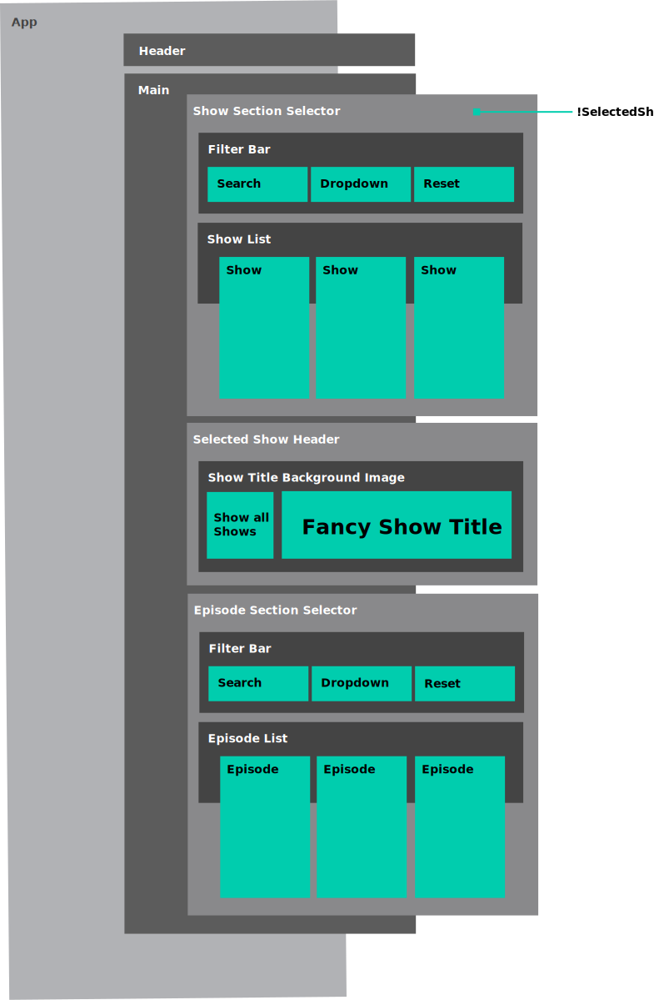

# TV Show Pair Project

<hr>
<p align="center">
⚠️ This team project is archived, but you can access the code and the development approach below ⚠️   
</p>
<hr>

__[Notion Project Page](https://glistening-estimate-b51.notion.site/Documentation-TV-Show-9f5c082c44fa4aafb93e7f0968e1ffdd)__


## Setup
```bash
$ git clone https://github.com/leahloading/c5r6-tv-show-project

# Install dependencies
$ yarn

# Serve Project
$ yarn start

Compiled successfully!

You can now view academy-react-starter in the browser.

  http://localhost:3000

Note that the development build is not optimized.
To create a production build, use yarn build.
```

## Brief

[WeAreAcademy/mark-react-proj--tv-shows](https://github.com/WeAreAcademy/mark-react-proj--tv-shows)

You must make a React app which shows details of all of the episodes of a TV show.

The episode data will come from TV Maze.

## UI Wireframe

